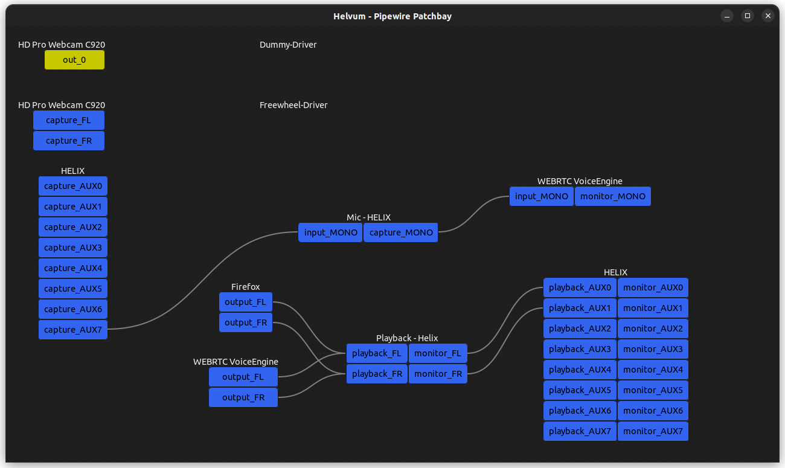
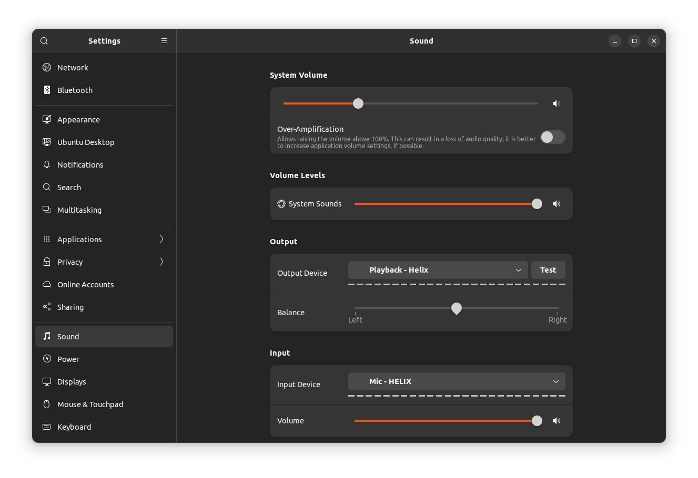

# Pipewire-pulse routing for Helix

Easier setup when using Helix as the main soundcard for simultaneous pro audio 
and desktop use.

This script allows to automatically connect the desktop apps to the Helix mic
(USB 8), and to the Helix monitoring (USB 1/2). For that, virtual sinks are 
created and set as default by pulseaudio (pipewire-pulse). The Helix mic and 
and monitoring remain connected to the virtual sinks.



## Installation
Clone the git repo
```
git clone https://github.com/ZelvStudio/helix-pipewire-pulse.git
```

Make the script executable
```
cd helix-pipewire-pulse
chmod +x use-helix-virtual-sinks
```


## Usage
Launch the script to create the virtual sinks and connect the Helix
```
./use-helix-virtual-sinks
```

You can check that it is working by opening your sound settings. You should 
see the devices 'Playback - Helix' and 'Mic - Helix' being used:


If you're using Gnome, you can set it up to automatically run on login using 
Startup Application. 

Alternatively, you can set it up to run on startup using
crontab.
Run `crontab -e`, and add at the end of the file:
```
@reboot /path/to/helix-pipewire-pulse/use-helix-virtual-sinks
```


## Motivation
When using pipewire, the Helix is detected as a Pro soundcard (8 in / 8 out). 
That is exactly what's needed for pro audio work, where one wants to manually 
route all ports. However, that creates some issues for apps using pulseaudio
(pipewire-pulse):
    1. When using the Helix Pro as input device in the desktop settings, 
    the apps always connect to the two first capture ports of the Helix. 
    If using a mic plugged in the Helix, the corresponding capture port is the 
    8th (by default, can be 7th). Therefore, one needs to manually connect the 
    8th port everytime.
    2. When recording (for example) firefox into Ardour/Reapper/Bitwig..., the 
    connections can only be made once firefox runs a stream.

Much like what was the common setup to use JACK and pulseaudio simultaneously, 
using persistent pulseaudio sinks mostly fixes those problems.

It would also be possible to create other virtual sources connected to the other 
capture ports of the Helix, and switch between them in Pulseaudio. 

